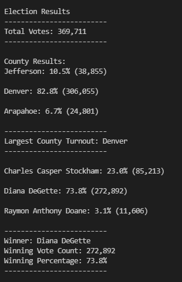

# election_analysis
Module 3 Bootcamp

# Election Analysis - Module 3 Challenge

## Overview of Project

The purpose of this project is to complete an election audit of a recent congressional election with data provided from the Colorado Board of Elections. The audit is comprised of the following goals:

1. Calculate the total number of votes cast
2. Get a complete list of candidates who recieved votes
3. Calculate the total number of votes each candidate recieved
4. Calculate the percentage of votes each candidate won 
5. Determing the winner of the election based on popular vote
6. The voter turnout for each county
7. The percentage of votes from each county out of the total count
8. The county with the highest turnout

The analysis of the project was completed using python to open, analyze and output the data to determine the results of the election and each goal.

## Resources Used
- Data Source: election_results.csv
- Software: Python 3.7.6, Visual Studio Code 1.63.2

## Analysis and Results

### Election Audit Results

A summary of the output of the python code contained in PyPoll.py is shown below.



### Summary of Results
- The total amount of votes cast in the election was 369,711 votes.
- Of the counties, Jefferson made 10.5% of the votes with 38,855 votes cast, Denver County made 82.8% of the votes with 306,055 votes cast and Arapahoe made 6.7% of the votes with 24,801 votes cast.
- As such, Denver was determined to have cast the largest amount of votes.
-  Of the candidates, Charles Casper Stockham recieved 23.0% of the votes with 85,213 votes, Diana DeGette 73.8% of the votes with 272,892 votes and the last candidate Raymon Anthony Doane recieved 3.1% of the votes with 11,606 votes.
- Diana DeGette was determined to be the winner of the elections, recieving 73.8% of the votes with 272,892 votes cast for them.

## Election Audit Summary

While a good portion of the ode used can be applied to other elections, there are some considerations to be made for applying it to future analyses. One such consideration is how the script currently imports data from the provided csv, as shown below.

```
# Get the candidate name from each row.
        candidate_name = row[2]

        #get county name
        county_name = row[1]
```

The script relies on specific data being in specific columns. For all future analyses, either the csv file needs to be adjusted to ensure the candidate and county names remain in the same columns, or that the code itself needs to be adjusted to match the csv file provided. 

Assuming this can be completed, the code should be able to run with any amount of counties and candidate options.

Another change that can be run that should rarely be an issue is dealing the result of a draw. While this would be uncommon for an election of this size, it could be an issue if the code is used for voting on a smaller scale, such as an internal vote where the pool of voters is much smaller then over 300 thousand voters. Based on the current code, in the event of a tie, the candidate who recieved their first vote earliest in the csv file would be declared the 'winner', as the code only checks for whether the count is greater, and not in the rare event it is equal.

``` 
if (votes > winning_count) and (vote_percentage > winning_percentage):
```

Some code and conditional statements could be added to account for this rare occasion to make it prepared for the rare chance.
